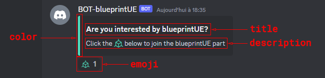

## Discord-bot

[](https://github.com/blueprintue/discord-bot/releases/latest)
[](https://github.com/blueprintue/discord-bot/releases/latest)
[](https://github.com/blueprintue/discord-bot/actions/workflows/build.yml)
[](https://hub.docker.com/r/blueprintue/discord-bot/)
[](https://hub.docker.com/r/blueprintue/discord-bot/)
[](https://goreportcard.com/report/github.com/blueprintue/discord-bot)
[](https://codecov.io/gh/blueprintue/discord-bot)

## Usage

### From binary

`discord-bot` binaries are available on [releases page](https://github.com/blueprintue/discord-bot/releases/latest).

### From Dockerfile

| Registry                                                                                                  | Image                             |
|-----------------------------------------------------------------------------------------------------------|-----------------------------------|
| [Docker Hub](https://hub.docker.com/r/blueprintue/discord-bot/)                                           | `blueprintue/discord-bot`         |
| [GitHub Container Registry](https://github.com/users/blueprintue/packages/container/package/discord-bot)  | `ghcr.io/blueprintue/discord-bot` |

## Build from source

```shell
git clone https://github.com/blueprintue/discord-bot.git discord-bot
cd discord-bot

# build docker image and output to docker with discord-bot tag (default)
docker buildx bake

# build multi-platform image
docker buildx bake image-all

# create artifacts in ./dist
docker buildx bake artifact-all
```

## Run docker image inside project
If you git clone you will see a `docker-composer.yml` already setup for local image.  
You need to create `config.json` in project folder.  
By default log folder is `/var/log/discord-bot` so you need to set:  
```json
    "log": {
      "filename": "/var/log/discord-bot/discord-bot.log",
      "level": "info"
    },
```
Then you can run image.
```shell
docker-compose up --build -d
```
If you want to use image from repository replace `image` in `docker-composer.yml`.

## Configuration explanations
### General
Mandatory parameters to run discord-bot without modules.

#### Discord
| JSON Parameter | ENV Parameter      | Mandatory | Type   | Description                                                |
| -------------- | ------------------ | --------- | ------ | ---------------------------------------------------------- |
| name           | DBOT_DISCORD_NAME  | YES       | string | discord server name (also called guild name)               |
| token          | DBOT_DISCORD_TOKEN | YES       | string | token for a bot                                            |

##### How to get discord name?
When you are on a discord server, you will see a list of channels on the left, at the top you will see the discord server name.

##### How to generate token?
You need to create a bot, you can start by looking at tutorial from Discord: [https://discord.com/developers/docs/getting-started](https://discord.com/developers/docs/getting-started).

#### Log
| JSON Parameter        | ENV Parameter                  | Mandatory | Type   | Specific values                                           | Default value | Description                                                                                                                                             |
| --------------------- | ------------------------------ | --------- | ------ | --------------------------------------------------------- | ------------- | ------------------------------------------------------------------------------------------------------------------------------------------------------- |
| filename              | DBOT_LOG_FILENAME              | YES       | string |                                                           |               | relative or absolute path to log file (it will create directories if not exist, for rotation you must use a directory with no other directories inside) |
| level                 | DBOT_LOG_LEVEL                 | NO        | string | trace \| debug \| info \| warn \| error \| fatal \| panic | ""            | level of log (if empty then no log)                                                                                                                     |
| number_files_rotation | DBOT_LOG_NUMBER_FILES_ROTATION | NO        | int    |                                                           | 0             | `0` if no rotation at all - just reopen file on rotation. e.g. you would like use logrotate; `>0` if rotation enabled                                   |

##### What is level?
It uses zerolog levels (from highest to lowest):
* panic (zerolog.PanicLevel, 5)
* fatal (zerolog.FatalLevel, 4)
* error (zerolog.ErrorLevel, 3)
* warn (zerolog.WarnLevel, 2)
* info (zerolog.InfoLevel, 1)
* debug (zerolog.DebugLevel, 0)
* trace (zerolog.TraceLevel, -1)

### Modules
#### Healthchecks
Uses the [Healthchecks.io](https://healthchecks.io) service to check whether `discord-bot` is online or not.  
It can triggers alerts on several systems if it is down.  

**If you don't want to use it, leave `uuid` empty.**  

You can use your own version by using a custom `base_url`.  

JSON configuration used:  
```json
"healthchecks": {
  "base_url": "https://hc-ping.com/",
  "uuid": "00000000-0000-0000-0000-000000000000",
  "started_message": "discord-bot started",
  "failed_message": "discord-bot failed"
}
```

| JSON Parameter  | Mandatory | Type   | Default value        | Description                                                       |
| --------------- | --------- | ------ | -------------------- | ----------------------------------------------------------------- |
| base_url        | NO        | string | https://hc-ping.com/ | url to ping, by default use the healthchecks service              |
| uuid            | YES       | string |                      | uuid, on healthchecks dashboard it's after `https://hc-ping.com/` |
| started_message | NO        | string | discord-bot started  | message sent to healthchecks when discord-bot starts              |
| failed_message  | NO        | string | discord-bot failed   | message sent to healthchecks when discord-bot stops               |

##### How it works?
Each time you start `discord-bot`, the healthchecks module will check the configuration in `config.json`.  
Then, when all modules have been started, it sends a `Start` ping message to indicate that the discord-bot is up and running.  
Finally, if `discord-bot` receives a signal from the OS to terminate the program, it will send a `Fail` ping message.

#### Welcome
Define the user's role when using an emoji.  
You can define one or more messages in only one channel.  
In each message you can define title, description, color, role and emoji to use.  

You can see an example below:  


JSON configuration used:  
```json
"welcome": {
  "channel": "😃test",
  "messages": [
    {
      "title": "Are you interested by blueprintUE?",
      "description": "Click the :blueprintUE: below to join the blueprintUE part",
      "color": 5301186,
      "role": "is member",
      "emoji": "blueprintUE",
      "can_purge_reactions": true,
      "purge_threshold_members_reacted": 100,
      "purge_below_count_members_not_in_guild": 10
    }
  ]
}
```

##### Channel
You can define only one channel.  

| JSON Parameter | Mandatory | Type   | Description  |
| -------------- | --------- | ------ | ------------ |
| channel        | YES       | string | channel name |

##### Message
You can defines multiple messages.  

| JSON Parameter                         | Mandatory | Type   | Default value | Description                                                                                         |
| -------------------------------------- | --------- | ------ | ------------- | --------------------------------------------------------------------------------------------------- |
| title                                  | YES       | string |               | title's message                                                                                     |
| description                            | YES       | string |               | description's message                                                                               |
| color                                  | NO        | int    | 0             | color on the left of the message (format is integer representation of hexadecimal color code)       |
| role                                   | YES       | string |               | role's name to assign when user use correct emoji                                                   |
| emoji                                  | YES       | string |               | emoji to use (format is my_emoji without `:`)                                                       |
| can_purge_reactions                    | NO        | bool   | false         | only on startup, allow the purging of reactions from users who are not on the Discord server        |
| purge_threshold_members_reacted        | NO        | int    | 0             | threshold for the number of users having reacted to the message                                     |
| purge_below_count_members_not_in_guild | NO        | int    | 0             | purge only if the number of invalid users is below a certain threshold                              |

##### How it works?
Each time you start `discord-bot`, welcome module will check the configuration in the `config.json`.  
If there is nothing missing, it will fetch channels, roles and emoji.  
Then it will do another check to see if channel, role and emoji exists.  

Secondly it will listen two events on `onMessageReactionAdd` and `onMessageReactionRemove`.  

After it will search the last 100 messages in the channel.  
If the message is not found then it will publish it and add a reaction to show user which emoji to use.  
If the message is found then it will fetch all reactions by the users and apply role.

If the user is no longer in the Discord server and you have set `can_purge_reactions` to `true` then it will:
1. check `purge_threshold_members_reacted` whether the threshold for the number of users who have reacted to the message has been exceeded or equal.
2. check `purge_below_count_members_not_in_guild` whether the number of invalid users is below or equal a certain threshold.

If the answer to these questions is positive, the reaction to the message will be deleted.  
For example you can set `purge_threshold_members_reacted` to 150 and `purge_below_count_members_not_in_guild` to 10.  
It will purge only if you have 150 or more reactions and only 10 or less users not in the server.  